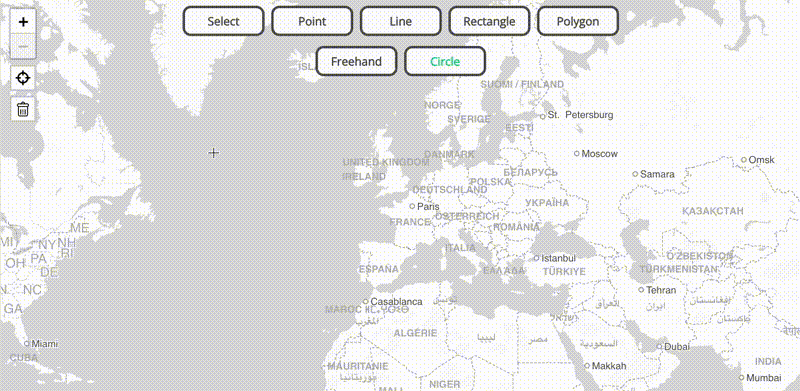

<picture>
  <source media="(prefers-color-scheme: dark)" srcset="./assets/logo-dark-mode.png">
  <source media="(prefers-color-scheme: light)" srcset="./assets/logo.png">
  
</picture>

 

Frictionless map drawing across mapping libraries.

Terra Draw centralizes map drawing logic and provides a host of out-of-the-box drawing modes that work across different JavaScript mapping libraries. It also allows you to bring your own modes!

### Library Support

Terra Draw uses the concept of 'adapters' to allow it to work with a host of different mapping libraries. Currently supported are:

- [Leaflet](https://leafletjs.com/) v1
- [OpenLayers](https://openlayers.org/) v10
- [Mapbox GL JS](https://www.mapbox.com/mapbox-gljs) v2
- [MapLibre](https://maplibre.org/maplibre-gl-js/docs/) v2/v3
- [Google Maps JS API](https://developers.google.com/maps/documentation/javascript/overview) v3
- [ArcGIS JavaScript SDK](https://developers.arcgis.com/javascript/latest/) v4 (MapView)

### Getting Started

Please see the [the getting started guide](./guides/1.GETTING_STARTED.md) - this provides a host of information on how to get up and running with Terra Draw.

### Development & Contributing

* For development, please see the [the development documentation](./guides/7.DEVELOPMENT.md)
* For guidance on contributing, please see the [the contributing documentation](./guides/7.DEVELOPMENT.md#contributing)

### Project Website

You can check out the official Terra Draw website at [terradraw.io](https://www.terradraw.io). If you are interested in contributing to the website please see [this repository](https://www.github.com/JamesLMilner/terra-draw-website).

### Contact

Email: [contact@terradraw.io](mailto:contact@terradraw.io)

### License

MIT
